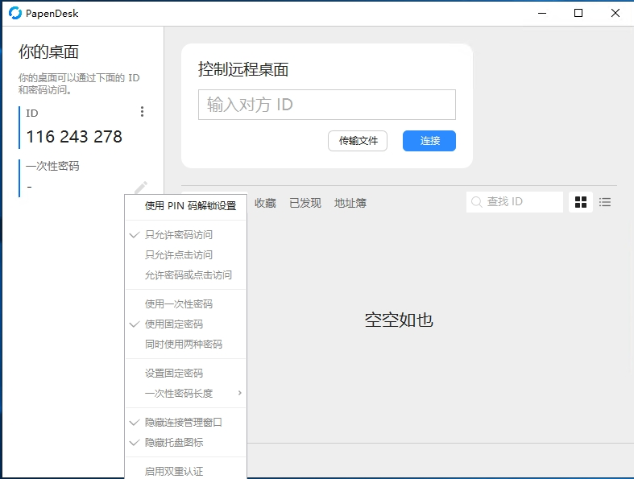
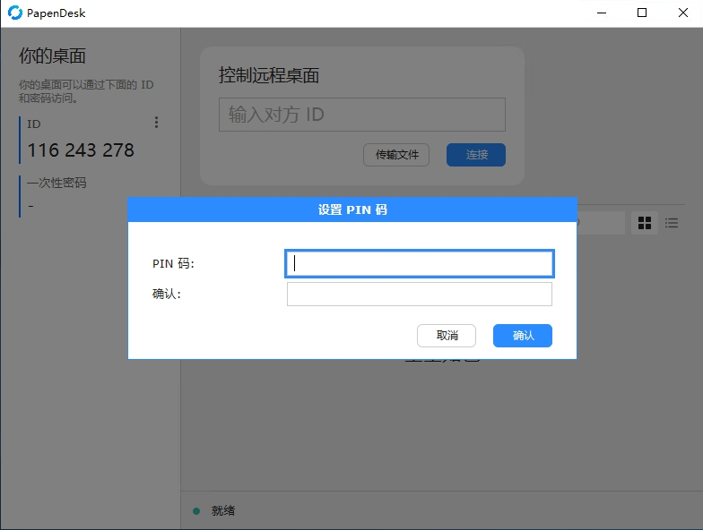
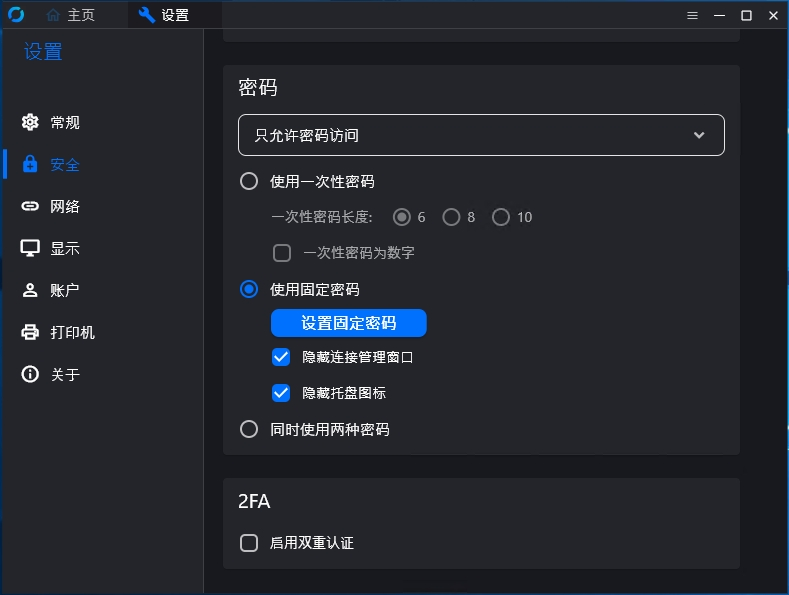

# 😍在lejianwen/rustdesk版本1.4.2的基础上实现以下功能😍

## 📚功能列表

### 🎯1. 隐藏CM管理窗口
📋 [功能分析报告](./allow-hide-cm功能分析报告.md)

### 🎯2. 隐藏托盘图标
📋 [功能分析报告](./hide-tray功能分析报告.md)

### 🎯3. 补全sciter框架下的PIN设置锁功能
📋 [功能分析报告](./unlock_pin功能分析报告.md)

### 🎯4. hbb_common子模块可以获取主项目的secrets
📋 [功能分析报告](./Repository_Secret传递功能分析报告.md)

### 🎯5. 解锁画质和FPS自定义

### 🎯6. 修复APP_NAME定义后部分平台编译问题

### 🎯7. hbb_common子模块config.rs部分常用设置给了注释

---
---

## 📚截图

---
---

## 📚 配套服务项目

### 🎯Server
- [lejianwen\rustdesk-server](https://github.com/lejianwen/rustdesk-server)

### 🎯API Server
- [lejianwen\rustdesk-api](https://github.com/lejianwen/rustdesk-api)

## 📚 文档索引

- [unlock_pin 功能分析报告](./unlock_pin功能分析报告.md)
- [allow-hide-cm 功能分析报告](./allow-hide-cm功能分析报告.md)
- [hide-tray 功能分析报告](./hide-tray功能分析报告.md)
- [Repository_Secret 传递功能分析报告](./Repository_Secret传递功能分析报告.md)