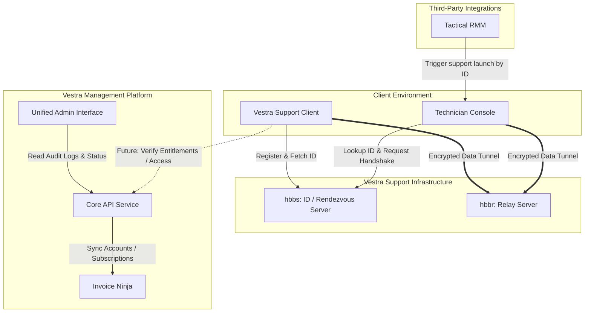

# High-Level Architecture Overview

This document presents the high-level architecture of the Vestra Support ecosystem, detailing how the custom desktop clients, self-hosted relay infrastructure, and internal portal components communicate.

---

## System Architecture Diagram

---

## Core Components

### 1. Client (RustDesk Fork)
The client application is compiled from our customized `vestrainteractive/vestra-support` repository:
* **Custom Configs**: Preloaded with Vestra's rendezvous/relay server endpoints and the corresponding public encryption key.
* **Branded Interface**: Stripped of standard upstream branding, presenting a simplified layout featuring the Vestra Support about info.
* **Security Layer**: Leverages NaCl/libsodium cryptography to secure all control and video streams.

### 2. Relay Infrastructure (`hbbs` & `hbbr`)
A dedicated, self-hosted server cluster:
* **`hbbs` (Rendezvous Server)**: Assigns hardware IDs, listens for connection requests, and coordinates NAT hole punching.
* **`hbbr` (Relay Server)**: Relays video and control streams when strict NAT constraints prevent a direct peer-to-peer (P2P) path between the operator and the client.

### 3. Support Portal & Core Backend
The business engine of the Vestra Platform:
* **Core API**: Houses client data, entitlements (support subscriptions, licenses), and authentication rules.
* **Admin Portal**: Used by Vestra staff to view active support ticket context, link system events, and search client accounts.
* **Invoice Ninja integration**: Acts as the customer authority, synchronizing accounting and subscription records with Core.

---

## Future Integrations

### 1. Tactical RMM Integration
To support rapid technician response:
* **Launcher Button**: Allows launching a support session directly from a machine view in the Tactical RMM console.
* **Service Deployment**: Standardizes silent background client installation on managed endpoints.

### 2. Vestra Portal & Entitlements
* **Verification**: In later phases, connection access can query the Core Entitlements API to verify that the target account has active support credentials before permitting remote sessions.
* **Customer Interface**: Allows customers to view remote connection history, approve unattended access requests, and log service tickets directly.
