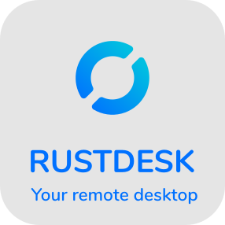

<p align="center">
  <br>
  <a href="#senpagaj-publikaj-serviloj">Serviloj</a> •
  <a href="#paŝoj-por-kompili">Kompili</a> •
  <a href="#kiel-kompili-kun-docker">Docker</a> •
  <a href="#dosierstrukturo">Strukturo</a> •
  <a href="#ekrankopio">Ekrankopio</a><br>
  [<a href="../README.md">English</a>] | [<a href="README-UA.md">Українська</a>] | [<a href="README-CS.md">česky</a>] | [<a href="README-ZH.md">中文</a>] | [<a href="README-HU.md">Magyar</a>] | [<a href="README-ES.md">Español</a>] | [<a href="README-FA.md">فارسی</a>] | [<a href="README-FR.md">Français</a>] | [<a href="README-DE.md">Deutsch</a>] | [<a href="README-PL.md">Polski</a>] | [<a href="README-ID.md">Indonesian</a>] | [<a href="README-FI.md">Suomi</a>] | [<a href="README-ML.md">മലയാളം</a>] | [<a href="README-JP.md">日本語</a>] | [<a href="README-NL.md">Nederlands</a>] | [<a href="README-IT.md">Italiano</a>] | [<a href="README-RU.md">Русский</a>] | [<a href="README-PTBR.md">Português (Brasil)</a>] | [<a href="README-KR.md">한국어</a>] | [<a href="README-AR.md">العربي</a>] | [<a href="README-VN.md">Tiếng Việt</a>] | [<a href="README-GR.md">Ελληνικά</a>]<br>
  <b>Ni bezonas helpon traduki tiun README kaj <a href="https://github.com/rustdesk/rustdesk/tree/master/src/lang">la interfacon</a> al via denaska lingvo</b>
</p>

Babili kun ni: [Discord](https://discord.gg/nDceKgxnkV) | [Twitter](https://twitter.com/rustdesk) | [Reddit](https://www.reddit.com/r/rustdesk) | [YouTube](https://www.youtube.com/@rustdesk)

[](https://rustdesk.com/pricing.html)

Denove alia fora labortabla programo, skribita en Rust. Ĝi funkcias elskatole, ne bezonas konfiguraĵon. Vi havas la tutan kontrolon sur viaj datumoj, sen zorgo pri sekureco. Vi povas uzi nian servilon rendezvous/relajsan, [agordi vian propran](https://rustdesk.com/server), aŭ [skribi vian propran servilon rendezvous/relajsan](https://github.com/rustdesk/rustdesk-server-demo).

RustDesk bonvenigas kontribuon de ĉiuj. Vidu [`docs/CONTRIBUTING.md`](CONTRIBUTING.md) por helpo komenci.

[**BINARA ELŜUTO**](https://github.com/rustdesk/rustdesk/releases)

## Dependantaĵoj

La labortabla versio uzas [sciter](https://sciter.com/) por la interfaco, bonvolu elŝuti la bibliotekon dinamikan sciter.

[Windows](https://raw.githubusercontent.com/c-smile/sciter-sdk/master/bin.win/x64/sciter.dll) |
[Linux](https://raw.githubusercontent.com/c-smile/sciter-sdk/master/bin.lnx/x64/libsciter-gtk.so) |
[MacOS](https://raw.githubusercontent.com/c-smile/sciter-sdk/master/bin.osx/libsciter.dylib)

## Paŝoj por kompili

- Preparu vian medion de programado Rust kaj vian medion de kompilado C++

- Instalu [vcpkg](https://github.com/microsoft/vcpkg), kaj agordu la medivariablon `VCPKG_ROOT` korekte

  - Windows: vcpkg install libvpx:x64-windows-static libyuv:x64-windows-static opus:x64-windows-static aom:x64-windows-static
  - Linux/MacOS: vcpkg install libvpx libyuv opus aom

- Plenumu `cargo run`

## Kiel kompili sur Linukso

### Ubuntu 18 (Debian 10)

```sh
sudo apt install -y g++ gcc git curl wget nasm yasm libgtk-3-dev clang libxcb-randr0-dev libxdo-dev libxfixes-dev libxcb-shape0-dev libxcb-xfixes0-dev libasound2-dev libpulse-dev cmake
```

### Fedora 28 (CentOS 8)

```sh
sudo yum -y install gcc-c++ git curl wget nasm yasm gcc gtk3-devel clang libxcb-devel libxdo-devel libXfixes-devel pulseaudio-libs-devel cmake alsa-lib-devel
```

### Arch (Manjaro)

```sh
sudo pacman -Syu --needed unzip git cmake gcc curl wget yasm nasm zip make pkg-config clang gtk3 xdotool libxcb libxfixes alsa-lib pipewire
```

### Instali vcpkg

```sh
git clone https://github.com/microsoft/vcpkg
cd vcpkg
git checkout 2023.04.15
cd ..
vcpkg/bootstrap-vcpkg.sh
export VCPKG_ROOT=$HOME/vcpkg
vcpkg/vcpkg install libvpx libyuv opus aom
```

### Ripari libvpx (Por Fedora)

```sh
cd vcpkg/buildtrees/libvpx/src
cd *
./configure
sed -i 's/CFLAGS+=-I/CFLAGS+=-fPIC -I/g' Makefile
sed -i 's/CXXFLAGS+=-I/CXXFLAGS+=-fPIC -I/g' Makefile
make
cp libvpx.a $HOME/vcpkg/installed/x64-linux/lib/
cd
```

### Kompili

```sh
curl --proto '=https' --tlsv1.2 -sSf https://sh.rustup.rs | sh
source $HOME/.cargo/env
git clone https://github.com/rustdesk/rustdesk
cd rustdesk
mkdir -p target/debug
wget https://raw.githubusercontent.com/c-smile/sciter-sdk/master/bin.lnx/x64/libsciter-gtk.so
mv libsciter-gtk.so target/debug
VCPKG_ROOT=$HOME/vcpkg cargo run
```

## Kiel kompili kun Docker

Komencu klonante la deponejon kaj kompilu la konteneron Docker:

```sh
git clone https://github.com/rustdesk/rustdesk
cd rustdesk
docker build -t "rustdesk-builder" .
```

Tiam, ĉiuj fojoj, kiuj vi bezonas kompili la programon, plenumu tiun komandon:

```sh
docker run --rm -it -v $PWD:/home/user/rustdesk -v rustdesk-git-cache:/home/user/.cargo/git -v rustdesk-registry-cache:/home/user/.cargo/registry -e PUID="$(id -u)" -e PGID="$(id -g)" rustdesk-builder
```

Notu, ke la unua kompilado povas daŭri longe, antaŭ ke la dependantaĵoj estu kaŝitaj, sekvaj kompiladoj estos pli rapidaj. Aldone, se vi bezonas specifi diferentajn argumentojn por la kompilkomando, vi povas fari ĝin en la fine de la komando, en la posicio `<OPTIONAL-ARGS>`. Ekzemple, se vi volas kompili version de eldono optimigita, vi plenumus la komandon supre, kun `--release`. La plenumebla dosiero disponeblos en la cela dosierujo sur via sistemo, kaj povos esti plenumita kun:

```sh
target/debug/rustdesk
```

Aŭ, se vi plenumas eldonan plenumeblan dosieron:

```sh
target/release/rustdesk
```

Bonvolu certigi, ke vi plenumas tiujn komandojn el la radiko de la deponejo RustDesk, alie la programo povus esti nekapabla de trovi la devigajn resursojn. Ankaŭ notu, ke la aliaj subkomandoj de cargo kiel `install` aŭ `run` momente ne estas subtenitaj per tiu metodo, ĉar instalus aŭ plenumus la programon en la kontenero anstataŭ de la gastiganto.

## Dosierstrukturo

- **[libs/hbb_common](https://github.com/rustdesk/rustdesk/tree/master/libs/hbb_common)**: videa kodeko, agordado, kovrilo tcp/udp, protobuf, funkcioj fs por dosiertransigo, kaj aliaj utilaĵaj funkcioj
- **[libs/scrap](https://github.com/rustdesk/rustdesk/tree/master/libs/scrap)**: ekrankaptado
- **[libs/enigo](https://github.com/rustdesk/rustdesk/tree/master/libs/enigo)**: operaciumspecifa kontrolo de klavaro/muso
- **[src/ui](https://github.com/rustdesk/rustdesk/tree/master/src/ui)**: interfaco
- **[src/server](https://github.com/rustdesk/rustdesk/tree/master/src/server)**: aŭdio/poŝo/enigo/videa servoj, kaj retkonektoj
- **[src/client.rs](https://github.com/rustdesk/rustdesk/tree/master/src/client.rs)**: starti konekto kun samtavolo
- **[src/rendezvous_mediator.rs](https://github.com/rustdesk/rustdesk/tree/master/src/rendezvous_mediator.rs)**: komuniki kun [rustdesk-server](https://github.com/rustdesk/rustdesk-server), atendi foran direktan (TCP hole punching) aŭ relajsatan konekton
- **[src/platform](https://github.com/rustdesk/rustdesk/tree/master/src/platform)**: operaciumspecifa kodo

## Ekrankopio


