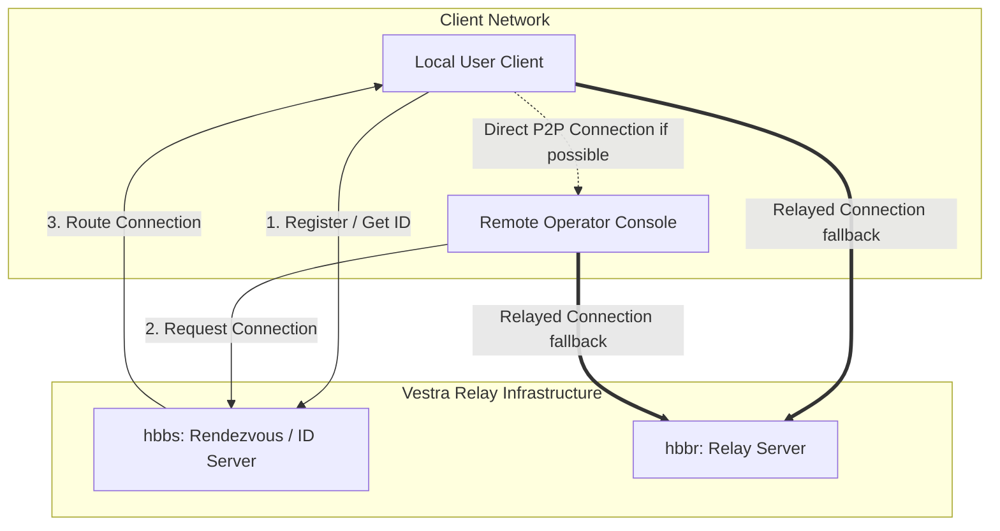

# Relay Infrastructure Requirements

This document specifies the setup, requirements, and deployment parameters for the self-hosted Vestra Support relay server network.

---

> [!WARNING]
> ## Current Status: Not Yet Implemented
> The relay infrastructure details below are conceptual and planned for Phase 1. No production servers or public DNS endpoints have been configured. Unmodified clients cannot currently establish sessions using Vestra-dedicated endpoints.

---

## Server Components

RustDesk architecture utilizes two central daemon services. Both must be deployed on public-facing servers with low-latency network access.

### 1. `hbbs` (ID / Rendezvous Server)
* **Purpose**: Coordinates registration of support clients, maps hardware IDs to active network sockets, handles connection handshakes, and facilitates peer-to-peer (P2P) NAT traversal.
* **Database**: Uses a light SQLite database locally to track registered client credentials and key mappings.

### 2. `hbbr` (Relay Server)
* **Purpose**: acts as a fallback proxy. If direct peer-to-peer connection cannot be established between the operator console and target machine (due to symmetric NATs, strict firewalls, etc.), connection traffic is relayed through this service.

---

## DNS Requirements

To avoid hardcoding IP addresses and allow routing flexibility, Vestra Support requires two public DNS A records pointing to the relay hosts:

| Domain (Placeholder) | Target Component | Notes |
| :--- | :--- | :--- |
| `id.support.vestrainteractive.com` | `hbbs` (ID Server) | Used by clients to register and find peers. |
| `relay.support.vestrainteractive.com` | `hbbr` (Relay Server) | Used to tunnel connection data. |

---

## Firewall & Port Configurations

The relay hosts must expose the following ports to the public internet. Ensure security groups and firewalls permit this traffic:

| Port | Protocol | Service | Purpose |
| :--- | :--- | :--- | :--- |
| **21115** | TCP | `hbbs` | NAT tunnel port test. |
| **21116** | TCP | `hbbs` | Main connection handshake and routing service. |
| **21116** | UDP | `hbbs` | NAT hole punching / registration query. |
| **21117** | TCP | `hbbr` | Relay server control connection. |
| **21118** | TCP | `hbbs` | Web client support (optional, reserved for future use). |
| **21119** | TCP | `hbbr` | Web client relay connection (optional, reserved for future use). |

---

## Monitoring Recommendations

Operational health metrics should be actively monitored on the hosting server:
* **Network Bandwidth**: Monitor egress/ingress bandwidth. Relayed connections (through `hbbr`) can consume significant network throughput depending on active session counts and screen resolutions.
* **CPU and Memory**: Track resource spikes. Both `hbbs` and `hbbr` are written in Rust and are highly efficient, but excessive session volume can impact performance.
* **Process Watch**: Use process monitors (e.g. systemd watchdog, supervisor, or Docker health checks) to ensure `hbbs` and `hbbr` services auto-restart on crash.
* **Connection Metrics**: Track open socket connections on port 21116 and 21117 to estimate active session counts.

---

## Backup Recommendations

Although the relay servers do not store user database data, the following configuration states should be backed up regularly:
* **Private/Public Key Pairs**: Located in the executable directory as `id_ed25519` and `id_ed25519.pub`. If these keys are lost or regenerated, all pre-configured client binaries will fail to authenticate with the server and will lock out remote connections.
* **Rendezvous Database**: The SQLite file (usually `db_ip.db`) used by `hbbs` to track client metadata.
* **Docker Compose Configurations**: Configuration environment variables and compose files.
