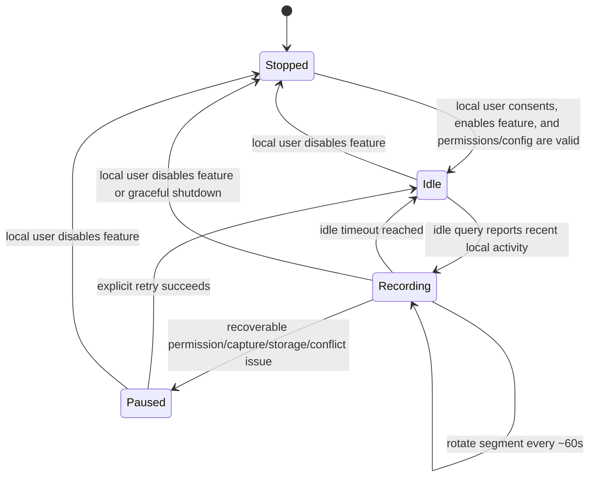
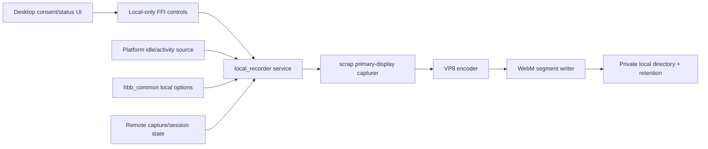

# feat: Add local activity screen recording

## Overview

Add an opt-in local activity screen recording feature for the RustDesk desktop client. When enabled, the client detects local user activity, records the local primary display during active periods, stops after idle timeout, and stores local WebM video segments of about one minute each. The custom implementation should remain concentrated in `libs/local_recorder/`, with only narrow manifest, config, FFI, and Flutter UI integration points outside that crate so future upstream RustDesk updates are easier to merge.

## Problem Frame

This is a local customization for a RustDesk client deployment, not remote-session recording and not a server-managed policy. The user wants local video evidence of periods when the local computer is actively operated. Because screen recordings can expose sensitive content, the feature must default to off, require explicit local enablement, make active recording visible, avoid persisting input contents, write files with restricted access, enforce retention/storage caps, and fail safely when capture, activity detection, permissions, remote-capture conflicts, or storage are unavailable.

## Requirements Trace

### Activity behavior

- R1. Detect local user activity without storing input contents and start recording only after activity is observed.
- R2. Stop recording after a 30-second idle timeout by default; keep idle timeout internally configurable for tests and future UI settings.

### Recording and storage

- R3. Save recordings locally as playable WebM files split into roughly one-minute segments.
- R9. Protect local recording output with restrictive directory/file permissions, opaque filenames, temp-file completion, startup cleanup, and default retention/storage caps.

### Architecture and integration

- R4. Keep the main implementation inside `libs/local_recorder/`; limit upstream-touching changes to manifests, config, FFI, and desktop UI.
- R5. Reuse RustDesk's existing capture and encoding patterns by following `libs/scrap/examples/record-screen.rs`; do not reuse the session `Recorder` wrapper because it consumes protobuf `EncodedVideoFrame` messages rather than raw local capture frames.
- R6. Expose a local-only desktop control surface to enable, disable, retry, and query recorder status.

### Failure handling and code quality

- R7. Handle privacy-sensitive failure modes explicitly: OS permission denial, unsupported activity detection, display changes, concurrent remote capture, encoder errors, disk write failure, orphaned temp segments, and graceful shutdown mid-segment.
- R8. Keep production Rust code aligned with project rules: no production `unwrap()` or `expect()`, no nested Tokio runtime, no locks across await points, no silent error ignores, and no unnecessary dependencies.

### Consent and privacy controls

- R10. Provide explicit local consent, clear default-language privacy text, and a visible active-recording indicator in the desktop UI.
- R11. Prevent config sync, custom-client overrides, remote policy, remote session state, environment variables, or server-managed settings from enabling local activity recording without the local UI consent path.

## Scope Boundaries

- This plan targets desktop RustDesk clients only. iOS and Android are excluded and must be gated out with platform `cfg` guards and target-gated dependencies.
- Initial implementation records the primary display only. Multi-display selection or simultaneous multi-display recording is deferred.
- Initial implementation supports Windows, macOS, and Linux X11 only where both activity detection and screen capture are available. Wayland is unsupported for v1 unless an existing portal-backed capture and idle/activity signal is already present and can be used without broad new platform code.
- This plan records the local display, not remote-session video streams already handled by RustDesk's existing session recorder.
- This plan does not add cloud upload, remote access to recordings, server synchronization, or remote policy enablement.
- This plan does not implement keystroke logging, mouse-coordinate logging, window-title logging, or persistence of input-event payloads.
- This plan does not promise crash-proof finalization. Graceful disable, idle-stop, rotation, and normal shutdown should finalize segments; force-kill, crash, or power loss may leave the active temp segment incomplete.

### Deferred to Separate Tasks

- Full localization and visual polish can follow after the privacy-critical enable/status flow is implemented. V1 still needs clear default-language consent, active-recording, paused/error, retry, and disable text.
- User-facing controls for segment duration, idle timeout, codec selection, multi-display recording, playback UI, and encryption-at-rest are deferred.
- Wayland support requires a separate design around portal-backed ScreenCast capture and activity/idle signals.

## Context & Research

### Relevant Code and Patterns

- `libs/local_recorder/` already contains partial scaffold code and tests for config, activity state, service state, storage, and writer planning; the missing production-critical pieces are real platform activity integration, capture loop, VPx/WebM writer integration, retry/status handling, consent UI, and build validation.
- `libs/scrap/` is the cross-platform screen capture crate and should remain the capture source.
- `libs/scrap/examples/record-screen.rs` is the primary implementation pattern: raw captured frames -> VPx encoder -> WebM muxer.
- `libs/scrap/src/common/record.rs` is useful for lifecycle and filename lessons, but the public `Recorder` is session-oriented and writes protobuf `EncodedVideoFrame` data, so it should not be directly reused for local raw-frame recording.
- `libs/scrap/src/common/vpxcodec.rs` and `libs/scrap/src/common/codec.rs` contain VPx encoder and codec abstractions relevant to WebM segment writing.
- `src/server/video_service.rs` is the main reference for capture-loop resilience, display changes, and concurrent remote-session capture concerns.
- `src/keyboard.rs` shows that RustDesk already uses the `rustdesk-org/rdev` fork with global grab/listen behavior; starting a second global hook would be risky and should be avoided.
- `src/server/input_service.rs` and existing platform-permission helpers inform permission reporting patterns.
- `libs/hbb_common/src/config.rs` is the central option/config location; existing `option2bool` semantics make absent `enable-*` options truthy, so local recording must explicitly default to `N` or avoid an absent-as-enabled option path.
- `src/flutter_ffi.rs` is the Rust/Flutter bridge for desktop UI controls.
- `flutter/lib/consts.dart`, `flutter/lib/desktop/pages/desktop_setting_page.dart`, and `flutter/lib/web/bridge.dart` already contain partial integration points that need completion and validation.

### Institutional Learnings

- No `docs/solutions/` directory or prior solution notes were found for local recording, activity monitoring, Flutter FFI settings, ffmpeg/WebM segment writing, or RustDesk desktop capture.
- Project guidance emphasizes small diffs, no unrelated refactors, no production `unwrap()`/`expect()`, no nested Tokio runtime, no locks across `.await`, careful dependency additions, and using tests to verify new behavior.
- `libs/scrap/README.md` notes that captured frames are packed BGRA but stride may exceed width and may vary; encoding must respect actual frame metadata.

### External References

- Platform-native idle APIs are safer than global keyboard/mouse hooks for activity-triggered recording: Windows `GetLastInputInfo`, macOS `CGEventSourceSecondsSinceLastEventType`, and Linux X11 `XScreenSaverQueryInfo` provide idle/activity detection without reading key contents.
- Global keyboard/mouse hooks are frequently treated like keylogger behavior by OS permission systems and security tools; use them only as a last resort and never persist event payloads.
- macOS screen capture requires Screen Recording permission; input monitoring permission can be avoided if idle detection uses event-source idle time instead of global input hooks.
- Linux Wayland screen capture requires xdg-desktop-portal ScreenCast/PipeWire flow, and generic passive global activity detection is not available; deferring Wayland is appropriate for v1.
- WebM/Matroska live files need graceful close for best seekability. Writing to `.webm.tmp`, closing/finalizing on rotation/idle/stop, and renaming to `.webm` limits crash fallout to the active segment.
- Screen recording output is sensitive even when stored locally; explicit consent, visible active status, local-only enablement, retention, and restrictive file permissions are feature requirements.

## Key Technical Decisions

- Implement and complete a new isolated crate under `libs/local_recorder/`; keep custom behavior there and keep unavoidable upstream-touching changes narrow.
- Add `scrap` and `webm`/VPx dependencies to `libs/local_recorder/Cargo.toml` behind desktop target gates as needed. Add the root `local_recorder` dependency under target-gated dependency sections so Android/iOS builds do not compile active recorder code.
- Prefer platform idle-time polling over raw global input hooks: Windows `GetLastInputInfo`, macOS event-source idle time, and Linux X11 XScreenSaver idle time. This satisfies activity detection without capturing key contents, avoids double-starting RustDesk's existing `rdev` hook, and reduces keylogger-class risk.
- Make production activity detection an `IdleSource` abstraction that returns only idle duration or active/idle state. Do not expose production APIs that accept raw keyboard events, mouse coordinates, window titles, focused-app names, or event payloads.
- Follow the `record-screen.rs` raw-frame pipeline: `scrap` capturer -> VPx encoder -> WebM muxer. Do not construct fake protobuf messages or reuse the session `Recorder` wrapper.
- Use VP8 for the initial background recorder unless repository APIs make VP9 materially simpler. VP8 is preferred for lower CPU overhead; VP9 can be a future option.
- Rotate by closing the current WebM file and opening a new file at about 60 seconds, on primary-display resolution change, or on graceful stop.
- Define a minimum valid segment duration before implementation. Segments shorter than that threshold should be deleted rather than marked complete.
- Use a 30-second default idle timeout. While idle, do not encode frames; accept that the first frames after activity may be missed because capture starts after activity is detected.
- Use opaque segment filenames and temp-file completion (`.webm.tmp` -> `.webm`) so incomplete recordings are distinguishable and filenames do not leak user activity patterns.
- Use filesystem metadata for ordering and cleanup in v1; do not introduce a separate protected manifest unless filesystem metadata proves insufficient during implementation.
- Use a private app-controlled output directory, not the system temp directory. If the existing partial code falls back to `std::env::temp_dir()`, replace that with RustDesk's existing app data/config directory helper or another private local app data directory.
- Remove `RUSTDESK_LOCAL_RECORDER_DIR` from production builds or gate it to debug/test builds. If a deployment override is retained, validate ownership, permissions, and symlink behavior before use.
- Enforce both storage-size caps and retention-age caps. Clean orphaned `.webm.tmp` files on startup before enforcing caps.
- Enforce restrictive directory/file permissions on Unix and Windows. Windows cannot remain a no-op for v1 because Windows is a primary desktop target.
- Refuse local recording while any remote session/capture state cannot be safely ruled out. If a precise active-capture signal is unavailable, use the conservative fallback: block local recording during active remote sessions.
- Treat local activity recording enablement as a local-user decision only. Do not allow custom-client config overrides, remote config, server policy, remote session state, or absent `enable-*` default semantics to start recording.
- Use a minimal status model, not a generic future-proof protocol: `disabled`, `waiting`, `recording`, `paused`, `error`, plus a reason field when applicable.

## Open Questions

### Resolved During Planning

- Segment duration: use 60 seconds by default, internally configurable for tests.
- Idle timeout: use 30 seconds by default, internally configurable for tests.
- File format: use WebM first, based on existing RustDesk WebM dependencies and `record-screen.rs`.
- Input trigger: use platform idle/activity queries where available; do not store input details.
- Display scope: primary display only for the initial version.
- Wayland scope: unsupported for the initial implementation unless existing portal-backed support is discovered without adding broad new platform code.
- Session `Recorder` reuse: do not reuse it directly; it is coupled to remote-session protobuf frames.
- UI placement: use a distinct local privacy/security setting named “Local activity recording” or equivalent, visually separated from remote-session recording options.

### Deferred to Implementation

- Exact type names and public function signatures: choose names that fit the final `libs/local_recorder/` layout.
- Exact local app data directory helper: reuse the repository's existing app-dir/config-dir helper if one exists; otherwise keep the path policy contained in `libs/local_recorder/src/storage.rs`.
- Exact remote-capture active signal: wire to an existing state signal if one is available; otherwise block local recording during active remote sessions.
- Exact desktop active-recording indicator implementation: choose the least invasive existing tray/status integration available, but the minimum state and behavior below are not optional.

## Output Structure

    libs/local_recorder/
    ├── Cargo.toml
    ├── src/
    │   ├── lib.rs
    │   ├── activity.rs
    │   ├── service.rs
    │   ├── writer.rs
    │   └── storage.rs
    └── tests/
        ├── activity_tests.rs
        ├── config_tests.rs
        ├── service_tests.rs
        └── writer_tests.rs

## High-Level Technical Design

> *This illustrates the intended approach and is directional guidance for review, not implementation specification. The implementing agent should treat it as context, not code to reproduce.*

## State Mapping

| Internal service state | FFI status | User-facing label | Recording indicator | Primary actions |
|---|---|---|---|---|
| `Stopped` | `disabled` | Disabled | Hidden | Enable |
| `Idle` | `waiting` | Enabled, waiting for local activity | Optional subtle enabled status; not active-recording indicator | Disable |
| `Recording` | `recording` | Recording local screen | Visible on all supported desktop platforms | Stop/disable; open settings if indicator supports click |
| `Paused(reason)` with actionable reason | `paused` + reason | Paused: action needed | Error/paused status visible in settings; active-recording indicator hidden | Retry, disable |
| `Paused(reason)` with permanent unsupported reason | `error` + reason | Unavailable on this platform/session | Hidden | Disable |

Errors are represented as paused/error statuses with explicit reasons rather than an unstructured generic failure. The UI must not show enabled/recording unless FFI status confirms waiting or recording.

## UI Interaction Contract

### Consent flow

1. User clicks the local activity recording toggle in desktop settings.
2. If local consent has not been recorded, show a blocking consent dialog before any FFI start call.
3. Dialog must disclose: local screen contents are recorded, recording starts only after local activity, input contents are not stored, files stay local, retention/storage caps apply, recordings are currently unencrypted unless encryption is later implemented, and the user can disable the feature at any time.
4. User chooses Cancel or Enable.
5. Cancel keeps the toggle off and makes no FFI start call.
6. Enable records local consent in a local-only setting that cannot be set by remote/custom-client overrides, then calls FFI start.
7. If OS permissions fail, UI moves to paused/error with actionable permission guidance and the toggle must not claim recording is active.

### Settings state table

| FFI status | Toggle value | Main text | Secondary text | Actions |
|---|---|---|---|---|
| `disabled` | Off | Local activity recording is off | No local screen recording will occur | Enable |
| `waiting` | On | Waiting for local activity | Recording starts when local keyboard/mouse activity is detected | Disable |
| `recording` | On | Recording local screen | Active segment is being saved locally | Disable/stop |
| `paused:PermissionDenied` | On with warning | Permission required | Grant screen recording permission, then retry | Retry, disable |
| `paused:StorageError` | On with warning | Storage unavailable | Check output directory or disk space, then retry | Retry, disable |
| `paused:ConcurrentRemoteCapture` | On with warning | Paused during remote session | End the remote session, then retry | Retry, disable |
| `error:UnsupportedPlatform` | Off or disabled | Not supported here | This platform/session cannot use local activity recording | Disable |
| Other error | Off or warning | Recording unavailable | Retry or disable | Retry, disable |

### Active recording indicator

- On every supported desktop platform, `recording` status must have a visible indicator outside the settings page.
- Preferred implementation is the existing tray/status area. If tray integration is unavailable on a supported platform, provide a persistent in-app status surface that remains visible while the main window is open and document the platform limitation in the UI.
- Indicator appears only while status is `recording`, not while merely waiting.
- Indicator click should open the settings/status page if supported by the existing tray/status framework.
- Indicator accessible name must communicate “Local screen recording active”.

### Accessibility and interaction requirements

- Consent dialog initial focus must land on the safer action or dialog title according to existing app patterns; Tab order must reach Cancel and Enable.
- Esc or dialog close is equivalent to Cancel.
- Toggle must expose accessible label, value, and hint that distinguish off, waiting, recording, paused, and error.
- State changes into recording, paused, or error should be announced by screen readers where Flutter platform support allows.
- Retry and disable buttons need clear accessible labels.
- Avoid marketing-style feature cards or generic “modern clean” UI; the UI should prioritize privacy understanding, current state, fast stop, and recovery.

### End-to-end user flows

- First enable success: user opens settings -> finds “Local activity recording” under privacy/security-related settings -> clicks toggle -> accepts consent -> status becomes waiting -> local activity occurs -> status becomes recording and indicator appears -> idle timeout returns to waiting.
- Permission failure: user accepts consent -> FFI returns permission error -> toggle shows paused/error with guidance -> user fixes OS permission -> clicks Retry -> status becomes waiting or recording.
- Background stop: user sees active recording indicator -> clicks it to open settings where supported -> disables recording -> active segment finalizes and indicator disappears.

## Implementation Units

- [ ] **Unit 1: Isolated local recorder crate scaffold and config contract**

**Goal:** Finish the independent feature directory, manifest wiring, platform gates, and stable configuration contract.

**Requirements:** R2, R4, R8, R9, R11

**Dependencies:** None

**Files:**
- Create/modify: `libs/local_recorder/Cargo.toml`
- Create/modify: `libs/local_recorder/src/lib.rs`
- Create/modify: `libs/local_recorder/src/storage.rs`
- Modify: `Cargo.toml`
- Test: `libs/local_recorder/tests/config_tests.rs`

**Approach:**
- Keep crate dependencies local and minimal, but add the real dependencies required for recording: `scrap` and the WebM/VPx muxing dependency used by `libs/scrap/examples/record-screen.rs`.
- Gate unsupported mobile targets out of active recorder startup paths and target-gate the root `local_recorder` dependency so Android/iOS builds do not compile active recorder code.
- Define testable local config structs for segment duration, idle timeout, retention days, storage cap, output directory, and minimum valid segment duration.
- Validate config before service startup and return structured errors/status reasons instead of panics.
- Ensure the default output directory is a private app-controlled directory, not `std::env::temp_dir()`.
- Remove production environment-variable output overrides or gate them to tests/debug builds with strict validation.
- Ensure local recording defaults to disabled even with RustDesk's `option2bool` absent-value behavior. Use explicit default `N`, a non-`enable-*` option name, or an equivalent guard.

**Execution note:** Implement configuration validation and storage-path behavior test-first because these are stable boundaries for the rest of the module.

**Patterns to follow:**
- Project Rust rules for error handling, dependency restraint, and no production `unwrap()`/`expect()`.
- `libs/scrap/Cargo.toml` for local crate dependency style.
- Existing config constants and app directory helpers in `libs/hbb_common/src/config.rs`.

**Test scenarios:**
- Happy path: default config yields a 60-second segment duration, 30-second idle timeout, and nonzero retention/storage caps.
- Happy path: configured non-default idle timeout and storage cap are preserved through service construction.
- Happy path: root dependency and public entry points are unavailable or stubbed on Android/iOS.
- Edge case: zero segment duration is rejected with a validation error.
- Edge case: zero idle timeout is rejected with a validation error.
- Error path: invalid output directory config returns an error instead of panicking.
- Error path: default output directory never resolves to the system temp directory.
- Error path: production build cannot use an unvalidated environment variable to redirect recordings.
- Error path: absent local-recorder option evaluates as disabled.

**Verification:**
- The new crate compiles for supported desktop targets.
- Mobile builds are not forced to compile active local recorder dependencies.
- Only manifest/config wiring outside `libs/local_recorder/` is touched in this unit.

- [ ] **Unit 2: Platform idle source without input persistence**

**Goal:** Detect local activity as an idle/recent-activity signal without storing input details or starting a second conflicting global input hook.

**Requirements:** R1, R2, R7, R8, R11

**Dependencies:** Unit 1

**Files:**
- Create/modify: `libs/local_recorder/src/activity.rs`
- Test: `libs/local_recorder/tests/activity_tests.rs`

**Approach:**
- Replace callback-style production activity APIs with an `IdleSource` abstraction that returns only idle duration or active/idle state.
- Prefer platform idle-query APIs over global input hooks: Windows `GetLastInputInfo`, macOS event-source idle time, Linux X11 XScreenSaver idle time.
- Break platform idle source implementation into platform-gated modules, each with explicit dependency/link handling and unsupported/error statuses.
- Treat Wayland and any platform without a safe idle source as unsupported for v1 rather than recording continuously or installing risky hooks.
- Avoid double-starting `rdev::grab` or equivalent global hooks. Only use existing passive signals if they already exist and do not expose event payloads.
- Do not store or expose keys, coordinates, text, window titles, focused app names, raw event payloads, or last cursor position in production structs.

**Execution note:** Implement pure idle-window behavior test-first with a fake idle-duration source; do not invoke platform APIs in unit tests.

**Patterns to follow:**
- `src/keyboard.rs` for understanding existing `rdev` singleton/global-hook constraints.
- `src/server/input_service.rs` for permission/status reporting style.

**Test scenarios:**
- Happy path: fake idle source reports idle until it returns recent activity.
- Happy path: after recent activity, `is_active` remains true until the idle timeout elapses.
- Edge case: multiple rapid activity observations update the last-activity timestamp monotonically.
- Edge case: production `activity.rs` exposes no API or field that stores coordinates, keys, or raw event payloads.
- Error path: platform idle-source startup/query failure returns a recoverable activity-source status.
- Error path: Wayland or unsupported listener environment reports unsupported without starting recording continuously.
- Integration: a fake idle source drives Idle -> Recording -> Idle transitions through the service clock without any global hook.

**Verification:**
- Activity detection can be tested without platform hooks.
- Production activity detection does not persist keystrokes or mouse coordinates.
- The implementation does not start a second conflicting `rdev::grab` loop.

- [ ] **Unit 3: WebM writer and local storage rotation**

**Goal:** Encode local capture frames into playable WebM files, rotate files at minute boundaries, and manage local retention/storage safety.

**Requirements:** R3, R5, R7, R8, R9

**Dependencies:** Unit 1

**Files:**
- Create/modify: `libs/local_recorder/src/writer.rs`
- Modify: `libs/local_recorder/src/storage.rs`
- Test: `libs/local_recorder/tests/writer_tests.rs`

**Approach:**
- Follow `libs/scrap/examples/record-screen.rs`: captured BGRA frame data is encoded with the VPx encoder path and written to a WebM muxer.
- Do not use `libs/scrap/src/common/record.rs::Recorder` directly because it expects protobuf `EncodedVideoFrame` values from remote sessions.
- Respect captured frame stride and size when preparing frames for encoding.
- Rotate by finalizing/closing the current WebM file and opening a new file after about 60 seconds, on primary-display resolution change, or on graceful stop.
- Use temporary filenames while writing and rename or mark complete only after graceful finalization.
- Delete orphaned `.webm.tmp` files on startup or before creating the first new segment.
- Use opaque filenames rather than timestamp-heavy names; use filesystem metadata for cleanup ordering in v1.
- Enforce both retention-age and storage-size caps when creating new segments, deleting oldest complete segments first.
- Account for the new segment when enforcing size caps, or enforce caps immediately after segment completion.
- Enforce restrictive directory and file permissions on Unix and Windows.
- Return disk and encoder failures through the module result/status path.

**Execution note:** Add tests around rotation decisions, opaque filename generation, retention deletion, temp cleanup, permission restriction, and writer finalization before integrating real capture frames.

**Patterns to follow:**
- `libs/scrap/examples/record-screen.rs` for raw frame capture, VPx encode, and WebM mux control flow.
- `libs/scrap/src/common/record.rs` for lifecycle lessons and minimum-duration cleanup, not as a direct API dependency.
- `libs/scrap/src/common/vpxcodec.rs` for encoder usage constraints.

**Test scenarios:**
- Happy path: a segment started at time T rotates after 60 seconds and produces a second opaque filename.
- Happy path: graceful disable finalizes the active segment and marks it complete.
- Happy path: retention cleanup removes oldest complete segments when the retention-age cap is exceeded.
- Happy path: storage cleanup removes oldest complete segments when the storage-size cap is exceeded.
- Happy path: directory and file permission restriction is applied or reports a clear unsupported/error status.
- Edge case: resolution change before 60 seconds forces a segment boundary.
- Edge case: a segment shorter than the minimum valid duration is removed rather than marked complete.
- Edge case: orphaned `.webm.tmp` files from a previous crash are deleted before new recording begins.
- Edge case: simulated graceful shutdown during a segment follows the same finalization path as disable.
- Error path: output directory creation or file creation failure returns a storage error and does not leave service state as recording.
- Error path: encoder initialization failure returns an encoder error without panicking.
- Integration: encode a small synthetic frame sequence, write a WebM file, and verify the file can be parsed or opened by available WebM tooling.

**Verification:**
- Segment rotation, temp cleanup, permission restriction, and retention behavior are covered without requiring real screen capture.
- A manual local run can create playable WebM files under the configured private local directory.

- [ ] **Unit 4: Recorder service state machine and capture loop**

**Goal:** Coordinate activity detection, primary-display screen capture, encoding, segment rotation, idle stop, concurrent capture policy, retry, and graceful shutdown.

**Requirements:** R1, R2, R3, R5, R7, R8

**Dependencies:** Units 2 and 3

**Files:**
- Create/modify: `libs/local_recorder/src/service.rs`
- Modify: `libs/local_recorder/src/lib.rs`
- Test: `libs/local_recorder/tests/service_tests.rs`

**Approach:**
- Model externally visible states as stopped, idle, recording, and paused, with status reasons for permission, unsupported platform, storage, capture, encoder, remote-capture conflict, and activity-source failures.
- Replace passive `tick()`-only bookkeeping with a real worker loop or driver owned by the service. The loop should poll the activity source, start capture when activity is recent, rotate segments, and stop after idle timeout.
- Replace `RefCell`-style scaffold state with thread-safe ownership suitable for an autonomous worker: channel-based commands plus lock/atomic status snapshots, or an equivalent `Send + Sync` safe design.
- Run blocking capture and encoding work on a dedicated thread or blocking-safe task; do not create a nested Tokio runtime.
- While idle, do not encode frames. Accept that first-frame capture may miss the first short activity burst.
- Before starting capture, check remote session/capture state through an integration-provided signal. If no reliable signal exists, block local recording while any remote session is active.
- On idle timeout, finalize the current segment and return to idle.
- On display change, permission loss, frame acquisition error, disk failure, encoder error, or remote-capture conflict, finalize what can be finalized and move to paused with a specific status reason.
- Add an explicit retry/resume action from paused state. Retry should re-check permissions, storage, activity source, and remote-capture conflict before returning to idle.
- Make start and stop idempotent. Repeated start must not spawn duplicate workers; stop before start must be safe.
- Provide a status snapshot that callers can query without holding locks across async boundaries.

**Technical design:** Directionally, the service loop consumes control commands, activity-source observations, remote-capture state, and capture/writer events. Stop commands must be able to finalize and stop recording even when capture is idle or paused.

**Patterns to follow:**
- `src/server/video_service.rs` for capture loop resilience and display/codec change handling.
- Project Tokio rules for blocking work, channel use, and lock boundaries.

**Test scenarios:**
- Happy path: enabling service enters idle state and no segment is created before activity.
- Happy path: activity while idle transitions to recording and starts a segment.
- Happy path: 65 seconds of active recording creates two segment windows.
- Happy path: 30 seconds without activity finalizes the segment and returns to idle.
- Happy path: paused service can be explicitly retried and returns to idle when prerequisites are valid.
- Edge case: disabling while recording finalizes the active segment and stops the worker.
- Edge case: disabling while idle stops the activity source without creating a file.
- Edge case: repeated start calls are idempotent and do not spawn duplicate workers.
- Edge case: stop before start is safe and reports stopped.
- Edge case: service worker drives idle timeout without relying on external callers to invoke `tick()` manually.
- Error path: capture permission denial transitions to paused and reports a clear status.
- Error path: active remote capture policy pauses local recording instead of starting a competing capturer.
- Error path: inability to determine remote session/capture state blocks recording conservatively.
- Error path: disk write failure finalizes or discards the current segment safely and stops further writes.
- Error path: poisoned or failed worker ownership can be recovered by stop/start or retry rather than making FFI permanently unavailable.
- Integration: fake activity source plus service state machine starts recording only after activity and stops after idle timeout.

**Verification:**
- The service can be started and stopped repeatedly without leaked worker threads.
- State transitions are deterministic under test-controlled time and mocked capture/segment dependencies.
- Idle timeout and segment rotation occur without a UI or FFI caller manually polling the service.

- [ ] **Unit 5: RustDesk config and local-only FFI wiring**

**Goal:** Expose the isolated recorder service through RustDesk's existing configuration and desktop UI bridge with minimal upstream-touching changes and local-only enablement semantics.

**Requirements:** R4, R6, R7, R8, R9, R11

**Dependencies:** Unit 4

**Files:**
- Modify: `libs/hbb_common/src/config.rs`
- Modify: `src/flutter_ffi.rs`
- Modify: `flutter/lib/web/bridge.dart`
- Modify: `Cargo.toml`
- Test: `libs/local_recorder/tests/service_tests.rs`

**Approach:**
- Add clearly named local recorder config options, defaulting to disabled, and ensure they are local-only rather than server-managed or remotely overrideable.
- Prevent custom-client config overwrite paths from setting local activity recording or local consent options. Explicitly skip these keys in any override mechanism that can be driven outside the local UI.
- Require a local consent flag/token set only by the desktop UI consent path before FFI start can enable recording.
- Preserve non-default local recorder config across start/stop. Stopping should stop the worker but should not discard config by replacing the service with a default instance unless config is rebuilt from persisted options.
- Add minimal FFI functions to start, stop, query status, and retry after paused/error states.
- Return a minimal structured status with state plus reason so Flutter can distinguish disabled, waiting, recording, paused, and error states.
- Store the service owner in a thread-safe singleton pattern consistent with the repository's existing global service patterns, but avoid lock re-entry and long-held locks.
- Make start idempotent, stop safe when already stopped, retry safe when not paused, and startup errors structured enough for Flutter display.
- Ensure generated/manual bridge declarations match the Rust FFI functions before build.
- Ensure FFI calls do not log sensitive screen or input data and do not allow remote sessions to enable local recording.

**Patterns to follow:**
- Existing option declarations and override paths in `libs/hbb_common/src/config.rs`.
- Existing Rust-to-Flutter command patterns in `src/flutter_ffi.rs`.
- Existing singleton service ownership patterns in RustDesk services where applicable.

**Test scenarios:**
- Happy path: default config has local activity recording disabled.
- Happy path: enabling through the Rust control surface starts the service when local consent, permissions, and output directory are valid.
- Happy path: disabling through the Rust control surface stops the service and finalizes any active segment.
- Happy path: retry through the Rust control surface recovers a paused service when prerequisites are valid.
- Edge case: repeated enable calls are idempotent and do not spawn duplicate workers.
- Edge case: repeated disable calls are safe when already stopped.
- Edge case: stop/start preserves configured idle timeout, segment duration, and storage cap.
- Error path: service startup failure returns a structured error/status to the FFI caller.
- Error path: a server-managed option update cannot enable local activity recording.
- Error path: custom-client override cannot set recording enabled or consent granted.
- Error path: FFI start refuses recording when local consent is absent, even if an option value is `Y`.
- Error path: bridge binding mismatch is caught by build or generated binding validation before reporting completion.

**Verification:**
- The feature can be controlled without importing local recorder internals throughout the app.
- Existing remote desktop connection and session recording code paths remain unchanged except for shared manifest/config/FFI insertions.
- FFI status is sufficient for the Flutter UI to display privacy-critical state accurately.

- [ ] **Unit 6: Desktop consent, enable path, and visible recording state**

**Goal:** Provide the privacy-critical desktop UI path that makes local recording explicit, locally controlled, and visible during background operation.

**Requirements:** R6, R7, R9, R10, R11

**Dependencies:** Unit 5

**Files:**
- Modify: `flutter/lib/consts.dart`
- Modify: `flutter/lib/desktop/pages/desktop_setting_page.dart`
- Modify: `flutter/lib/web/bridge.dart`
- Test: `flutter/test/` relevant widget or model test file chosen during implementation

**Approach:**
- Add or complete a default-off local recording control named “Local activity recording” or equivalent in a privacy/security-related desktop settings area, near but visually distinct from remote-session recording options.
- Implement the consent flow, state table, active indicator, accessibility, and user flows defined in this plan's UI Interaction Contract.
- Require explicit first-enable confirmation before calling the Rust start function.
- Display separate user-facing states for disabled, enabled waiting for activity, actively recording, paused, and error.
- Provide an always-visible background indicator when recording is active on supported desktop platforms.
- Provide clear retry/recheck paths for permission, storage, capture, unsupported platform, and remote-capture-conflict failures.
- Keep localization/polish deferred, but do not defer consent, status, disable, retry, or active-recording visibility.

**Patterns to follow:**
- Existing Flutter desktop settings structure under `flutter/lib/desktop/`.
- Existing Flutter FFI binding patterns in `flutter/lib/web/bridge.dart` and related generated bridge files.
- Existing platform-permission UI patterns that call screen/input permission checks.

**Test scenarios:**
- Happy path: control defaults off and displays disabled status.
- Happy path: enabling after consent calls the Rust start function and shows waiting/recording status returned by FFI.
- Happy path: active recording state changes the visible tray/status indicator where supported.
- Happy path: retry action calls the Rust retry function and updates status.
- Edge case: user cancels consent and the setting remains disabled.
- Edge case: waiting state is distinct from disabled so users know activity monitoring is enabled.
- Edge case: paused/error status is displayed with retry and disable actions.
- Edge case: FFI reports stopped after toggle-on attempt, and UI reverts rather than claiming recording is enabled.
- Edge case: screen reader labels distinguish waiting, recording, paused, and error states.
- Error path: FFI startup error is shown as a user-visible failure and the toggle does not claim recording is active.

**Verification:**
- A local user can explicitly enable, retry, and disable the feature from the desktop client.
- The UI never implies recording is active when the Rust service reports stopped or failed.
- Active recording remains visible when the main settings page is not open, where the platform supports a tray/status indicator.

- [ ] **Unit 7: Build, platform validation, and manual recording verification**

**Goal:** Verify the completed feature builds and works as a runnable desktop client, including real local recording output.

**Requirements:** R1, R3, R6, R7, R8, R9, R10, R11

**Dependencies:** Units 1-6

**Files:**
- Modify if needed: build or bridge files touched by compilation feedback
- Test: `libs/local_recorder/tests/activity_tests.rs`
- Test: `libs/local_recorder/tests/config_tests.rs`
- Test: `libs/local_recorder/tests/service_tests.rs`
- Test: `libs/local_recorder/tests/writer_tests.rs`

**Approach:**
- Run crate-level tests for `libs/local_recorder` before broader workspace builds.
- Regenerate Flutter Rust bridge files after finalizing Rust FFI functions, following the repository's existing `flutter_rust_bridge_codegen` flow.
- Validate Rust compilation errors first, then Flutter bridge/binding errors, then runnable desktop packaging/build errors.
- Perform a manual desktop run on the current platform: enable after consent, generate local activity, confirm recording starts, wait through a rotation boundary or shorten segment duration for a development build, stop/idle, and verify playable WebM output in the private local directory.
- Validate the no-activity path: enable and remain idle; no segment should be created until activity is observed.
- Validate failure visibility where practical: invalid output directory or permission denial should move to paused/error and keep the UI honest.

**Test scenarios:**
- Happy path: local recorder tests pass for config, activity source logic, service state, storage retention, and writer rotation.
- Happy path: desktop client builds successfully with the new crate and FFI bridge.
- Happy path: manual local run creates playable WebM segments after local activity.
- Edge case: enabling while idle creates no file until activity is detected.
- Edge case: disabling during active recording finalizes or removes the active temp segment according to writer rules.
- Error path: build-time bridge mismatch is fixed before runtime validation.
- Error path: storage failure is user-visible and does not leave the UI claiming recording is active.

**Verification:**
- The project builds into a runnable desktop program for the current development platform.
- The generated/runnable program can create local playable WebM recordings with the intended consent, status, idle-stop, and rotation behavior.

## System-Wide Impact

- **Interaction graph:** Flutter UI calls local-only FFI controls; FFI owns or accesses the local recorder service; the service polls platform idle/activity state and remote-capture state; when active it captures primary-display frames from `scrap`, encodes via VP8, writes WebM files, and applies storage cleanup.
- **Error propagation:** Activity-source, capture, permission, encoder, storage, unsupported platform, and concurrent remote capture statuses should move through local recorder status into FFI, then to UI-visible messages.
- **State lifecycle risks:** Worker leaks, duplicate activity sources, unfinalized WebM files, orphaned temp files, unsafe retries, lost config on stop, override-bypassed consent, absent-option default enablement, and partial files are the main lifecycle risks; idempotent start/stop, explicit retry, startup temp cleanup, preserved config, local consent guard, explicit disabled defaults, and finalization mitigate them.
- **API surface parity:** Existing remote-session recording APIs should not change; this is a separate local recorder surface.
- **Integration coverage:** Unit tests can cover state, rotation, retention, temp cleanup, permission restriction, and writer logic, but manual desktop validation is required for real capture, OS permissions, tray/status visibility, and playable output.
- **Unchanged invariants:** RustDesk remote control, remote video streaming, existing session recording, rendezvous, and file transfer behaviors should remain unchanged.

## Risks & Dependencies

| Risk | Mitigation |
|------|------------|
| Global keyboard/mouse hooks resemble keylogger behavior | Prefer platform idle-query APIs and never persist input contents or event payloads. |
| macOS permissions prevent capture | Check/report screen-recording permission and keep service paused until explicit retry after the user grants permission. |
| Wayland lacks simple passive global activity monitoring and uses portal-mediated capture | Mark Wayland unsupported in v1 and show a clear status instead of silently failing. |
| Existing `rdev` global hook conflicts with a new listener | Do not start a second grab loop; use idle queries or existing passive signals only. |
| Session `Recorder` cannot handle raw local frames | Follow `record-screen.rs` raw-frame encode/mux pattern with a local writer. |
| Segment files are unplayable after force-kill or crash | Use temp filenames, finalize on graceful paths, clean orphaned temp files on next startup, and document crash limitations. |
| Disk fills during recording | Enforce storage-size cap, retention-age cap, oldest-complete deletion, and pause on write failure. |
| Stop/start loses non-default recorder config | Preserve service config or rebuild service from persisted local config before each start. |
| `enable-*` absent-option semantics accidentally enable recording | Explicitly default the option to `N`, use a safer option name, or enforce disabled default in FFI/config loading. |
| Custom-client or server-managed config bypasses consent | Exempt recorder enable/consent keys from override paths and require a local UI consent token before FFI start. |
| Environment variable redirects recording output | Remove production env override or gate it to debug/test builds with ownership, permissions, and symlink validation. |
| Upstream updates conflict with customization | Keep core logic in `libs/local_recorder/`; expect manual conflict resolution for `Cargo.toml`, `config.rs`, `flutter_ffi.rs`, and UI insertions. |
| Privacy concerns from recording screen contents | Default off, local-only enablement, explicit consent, visible active status, no input-content persistence, no sensitive logging, restrictive permissions. |
| CPU usage during idle periods | Do not encode frames while idle; use VP8 first for lower background CPU overhead. |
| Concurrent remote and local capture causes performance or API conflicts | Block local recording while active remote sessions exist unless concurrent capture has been validated. |
| Recordings are plaintext WebM files | Disclose this in consent for v1; require encryption-at-rest before broad deployment on shared or high-sensitivity machines. |

## Documentation / Operational Notes

- Document the local output directory, default segment duration, idle timeout, retention/storage caps, primary-display limitation, and platform limitations in the UI or a short user-facing note after implementation.
- Do not log screen contents, keystrokes, mouse coordinates, window titles, recording filenames with user-identifying timestamps, or file contents.
- Document that graceful paths finalize active segments but crash, force-kill, or power loss can leave the newest temp segment incomplete.
- Consent text must state whether recordings are encrypted. If v1 stores plaintext WebM, disclose that plainly.
- If deployment requires stronger privacy controls, add encryption-at-rest before broad rollout.

## Sources & References

- Related code: `libs/local_recorder/`
- Related code: `libs/scrap/`
- Related code: `libs/scrap/examples/record-screen.rs`
- Related code: `libs/scrap/src/common/record.rs`
- Related code: `libs/scrap/src/common/vpxcodec.rs`
- Related code: `src/server/video_service.rs`
- Related code: `src/server/input_service.rs`
- Related code: `src/keyboard.rs`
- Related code: `libs/hbb_common/src/config.rs`
- Related code: `src/flutter_ffi.rs`
- Related code: `flutter/lib/web/bridge.dart`
- Related code: `flutter/lib/desktop/pages/desktop_setting_page.dart`
- External docs: Apple ScreenCaptureKit documentation
- External docs: xdg-desktop-portal ScreenCast specification
- External docs: Matroska streaming and element specifications
- External docs: Microsoft `GetLastInputInfo` documentation
- External docs: EDPB Guidelines 01/2024 on workplace data processing
